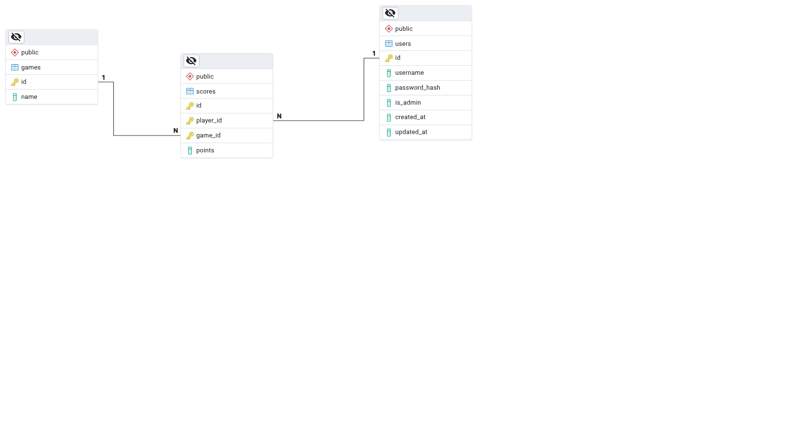

# 🕹️ Go Scoring API

API RESTful para gestionar puntuaciones de jugadores en distintos juegos. Incluye autenticación, control de acceso, métricas, pruebas unitarias, y soporte para despliegue con Docker.

---

## 📦 Tecnologías Utilizadas

- 🐹 Go 1.24
- 🔥 Gin (router HTTP)
- 🐘 PostgreSQL
- 🐳 Docker & Docker Compose
- 🔐 JWT para autenticación
- 📊 Prometheus + Grafana para métricas
- 📚 GORM como ORM
- 🧪 Ginkgo + Gomega para testing

---

## 🚀 ¿Cómo ejecutar el proyecto?

### 1. Requisitos

- Tener instalado Docker y Docker Compose:
  - [Docker](https://docs.docker.com/get-docker/)
  - [Docker Compose](https://docs.docker.com/compose/)

### 2. Clonar el repositorio

```bash
git clone https://github.com/Martin-Arias/go-scoring-api.git
cd go-scoring-api
```

### 3. Configurar variables de entorno

Crear un archivo `.env` basado en `.env.example`:

```dotenv
DB_HOST=db
DB_PORT=5432
DB_USER=postgres
DB_PASSWORD=postgres
DB_NAME=scoring_db
JWT_SECRET=supersecretkey
```

### 4. Levantar el entorno con Docker

```bash
docker compose up --build
```

La API estará disponible en: [http://localhost:8080](http://localhost:8080)

Prometheus en: [http://localhost:9090](http://localhost:9090)
Grafana en: [http://localhost:3000](http://localhost:3000)

---

## 🧪 Ejecutar Tests

```bash
make test
```

Verificar el coverage:

```bash
make test-cover
```

---

## 📚 Swagger

La documentación interactiva de los endpoints está disponible en:

🔗 [http://localhost:8080/swagger/index.html](http://localhost:8080/swagger/index.html)

---

## 📘 Endpoints disponibles

### 🔐 Autenticación

| Método | Endpoint         | Descripción            |
| ------ | ---------------- | ---------------------- |
| POST   | `/auth/register` | Crear un nuevo usuario |
| POST   | `/auth/login`    | Obtener token JWT      |

---

### 🎮 Juegos

| Método | Endpoint     | Requiere Token | Rol        | Descripción             |
| ------ | ------------ | -------------- | ---------- | ----------------------- |
| POST   | `/api/games` | ✅ Sí          | 🛡️ Admin   | Crear un nuevo juego    |
| GET    | `/api/games` | ✅ Sí          | Cualquiera | Listar todos los juegos |

---

### 📈 Puntuaciones

| Método | Endpoint                 | Requiere Token | Rol        | Descripción                                         |
| ------ | ------------------------ | -------------- | ---------- | --------------------------------------------------- |
| PUT    | `/api/scores`            | ✅ Sí          | 🛡️ Admin   | Registrar o actualizar puntaje de un usuario        |
| GET    | `/api/scores/user`       | ✅ Sí          | Cualquiera | Ver scores por `user_id` (query param)              |
| GET    | `/api/scores/game`       | ✅ Sí          | Cualquiera | Ver scores por `game_id` (query param)              |
| GET    | `/api/scores/game/stats` | ✅ Sí          | Cualquiera | Ver media, mediana y moda de puntuaciones por juego |

---

### 📊 Métricas

| Método | Endpoint   | Descripción         |
| ------ | ---------- | ------------------- |
| GET    | `/metrics` | Métricas Prometheus |

---

## 📈 Observabilidad

Este proyecto también incluye soporte para monitoreo a través de:

### 🔹 Prometheus

Expone métricas en el endpoint `/metrics` para ser recolectadas por Prometheus.
Las métricas incluyen:

- Total de requests por ruta y método

### 🔹 Grafana

Grafana está preconfigurado para visualizar las métricas exportadas por Prometheus.

- 📍 URL: [http://localhost:3000](http://localhost:3000)
- Usuario: `admin`
- Contraseña: `admin`

Ambos servicios se ejecutan junto con la API usando `docker-compose`.

---

## 🗃️ Estructura del proyecto

```
.
├── cmd/
│   └── main.go         # Punto de entrada
├── internal/
│   ├── handler/        # Handlers HTTP
│   ├── repository/     # Repositorios
│   ├── model/          # Modelos GORM
│   ├── dto/            # Data Transfer Objects
│   ├── middleware/     # Middlewares de auth y métricas
│   ├── db/             # Migraciones
│   └── utils/          # Funciones auxiliares (estadísticas, etc)
├── Dockerfile
├── docker-compose.yml
├── .env
└── README.md
```

---

## 🛡️ Seguridad

- Contraseñas hasheadas con `bcrypt`.
- Acceso con JWT (`Bearer <token>`).
- Endpoints protegidos por middleware.
- Autorización basada en rol (`admin`, `user`).

---

## 🧼 Scripts útiles

| Comando             | Descripción                  |
| ------------------- | ---------------------------- |
| `make test`         | Corre todos los tests        |
| `make cover`        | Muestra el coverage          |
| `make build`        | Compila el binario principal |
| `docker compose up` | Levanta entorno local        |

---



## ✍️ Autor

Desarrollado por [Martin Arias](https://github.com/Martin-Arias)
